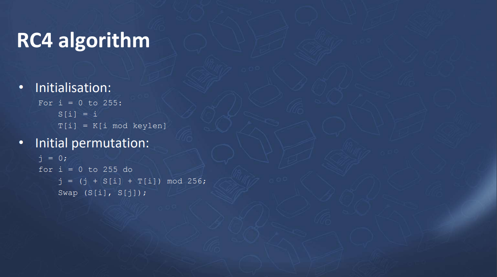

# KIJ - Assignment 1

---

|       NRP      |            NAMA            |
|----------------|----------------------------|
| 05111940000050 | Erki Kadhafi Rosyid        |
| 05111940000105 | I Kadek Agus Ariesta Putra |
| 05111940000113 | Putu Ananda Satria Adi     |
| 05111940000161 | Timotius Wirawan           |

GitHub Repo: [https://github.com/anandasatriaadi/KIJ-Cryptography](https://github.com/anandasatriaadi/KIJ-Cryptography)

---

# Program Description & Features

## 1. AES (Advanced Encryption Standard)

The AES Encryption is created based on the following resources:

1. Classroom powerpoint files
2. [Understanding Cryptography a Textbook for-Students and Practitioners.pdf](https://ariesta.club/files/Understanding%20Cryptography%20a%20Textbook%20for-Students%20and%20Practitioners.pdf)
3. [Rijndael S-box](https://en.wikipedia.org/wiki/Rijndael_S-box)
4. [How does one implement the Inverse of AES' MixColumns](https://crypto.stackexchange.com/questions/2569/how-does-one-implement-the-inverse-of-aes-mixcolumns)?

We made it using C++ programming language, the feature can be found in the following class structure:

```cpp
class AES {
    private:
        const uint N_BLOCK      = 4;
        const uint BLOCK_LEN    = 16;
        const uint N_COLUMN     = 4;
        const uint N_ROUND      = 10;
        unsigned char *IV = (unsigned char*)"B3TUTUG1L1M4NUK";
        unsigned char *KEY = (unsigned char*)"4Y4MB4K4RB3TUTU";
        unsigned char *CBC_XORER = new unsigned char[BLOCK_LEN];
        // const unsigned char *IV = new unsigned char [0x63, 0x7c, 0x77, 0x7b, 0xf2, 0x6b, 0x6f, 0xc5, 0x30, 0x01, 0x67, 0x2b, 0xfe, 0xd7, 0xab, 0x76];
        // const unsigned char *KEY = new unsigned char [0xd0, 0xef, 0xaa, 0xfb, 0x43, 0x4d, 0x33, 0x85, 0x45, 0xf9, 0x02, 0x7f, 0x50, 0x3c, 0x9f, 0xa8];

        unsigned char MUL_CONSTANT[4][4] = {
            {0x02, 0x03, 0x01, 0x01},
            {0x01, 0x02, 0x03, 0x01},
            {0x01, 0x01, 0x02, 0x03},
            {0x03, 0x01, 0x01, 0x02}};

        unsigned char INV_MUL_CONSTANT[4][4] = {
            {0x0E, 0x0B, 0x0D, 0x09},
            {0x09, 0x0E, 0x0B, 0x0D},
            {0x0D, 0x09, 0x0E, 0x0B},
            {0x0B, 0x0D, 0x09, 0x0E},
        };
        
        const unsigned char RC_LIST[10+1]{0x01, 0x02, 0x04, 0x08, 0x10, 0x20, 0x40, 0x80, 0x1B, 0x36};

        const unsigned char SBOX[16][16] = {
            {0x63, 0x7c, 0x77, 0x7b, 0xf2, 0x6b, 0x6f, 0xc5, 0x30, 0x01, 0x67, 0x2b, 0xfe, 0xd7, 0xab, 0x76},
            {0xca, 0x82, 0xc9, 0x7d, 0xfa, 0x59, 0x47, 0xf0, 0xad, 0xd4, 0xa2, 0xaf, 0x9c, 0xa4, 0x72, 0xc0},
            {0xb7, 0xfd, 0x93, 0x26, 0x36, 0x3f, 0xf7, 0xcc, 0x34, 0xa5, 0xe5, 0xf1, 0x71, 0xd8, 0x31, 0x15},
            {0x04, 0xc7, 0x23, 0xc3, 0x18, 0x96, 0x05, 0x9a, 0x07, 0x12, 0x80, 0xe2, 0xeb, 0x27, 0xb2, 0x75},
            {0x09, 0x83, 0x2c, 0x1a, 0x1b, 0x6e, 0x5a, 0xa0, 0x52, 0x3b, 0xd6, 0xb3, 0x29, 0xe3, 0x2f, 0x84},
            {0x53, 0xd1, 0x00, 0xed, 0x20, 0xfc, 0xb1, 0x5b, 0x6a, 0xcb, 0xbe, 0x39, 0x4a, 0x4c, 0x58, 0xcf},
            {0xd0, 0xef, 0xaa, 0xfb, 0x43, 0x4d, 0x33, 0x85, 0x45, 0xf9, 0x02, 0x7f, 0x50, 0x3c, 0x9f, 0xa8},
            {0x51, 0xa3, 0x40, 0x8f, 0x92, 0x9d, 0x38, 0xf5, 0xbc, 0xb6, 0xda, 0x21, 0x10, 0xff, 0xf3, 0xd2},
            {0xcd, 0x0c, 0x13, 0xec, 0x5f, 0x97, 0x44, 0x17, 0xc4, 0xa7, 0x7e, 0x3d, 0x64, 0x5d, 0x19, 0x73},
            {0x60, 0x81, 0x4f, 0xdc, 0x22, 0x2a, 0x90, 0x88, 0x46, 0xee, 0xb8, 0x14, 0xde, 0x5e, 0x0b, 0xdb},
            {0xe0, 0x32, 0x3a, 0x0a, 0x49, 0x06, 0x24, 0x5c, 0xc2, 0xd3, 0xac, 0x62, 0x91, 0x95, 0xe4, 0x79},
            {0xe7, 0xc8, 0x37, 0x6d, 0x8d, 0xd5, 0x4e, 0xa9, 0x6c, 0x56, 0xf4, 0xea, 0x65, 0x7a, 0xae, 0x08},
            {0xba, 0x78, 0x25, 0x2e, 0x1c, 0xa6, 0xb4, 0xc6, 0xe8, 0xdd, 0x74, 0x1f, 0x4b, 0xbd, 0x8b, 0x8a},
            {0x70, 0x3e, 0xb5, 0x66, 0x48, 0x03, 0xf6, 0x0e, 0x61, 0x35, 0x57, 0xb9, 0x86, 0xc1, 0x1d, 0x9e},
            {0xe1, 0xf8, 0x98, 0x11, 0x69, 0xd9, 0x8e, 0x94, 0x9b, 0x1e, 0x87, 0xe9, 0xce, 0x55, 0x28, 0xdf},
            {0x8c, 0xa1, 0x89, 0x0d, 0xbf, 0xe6, 0x42, 0x68, 0x41, 0x99, 0x2d, 0x0f, 0xb0, 0x54, 0xbb, 0x16}
        };
        
        const unsigned char INVERSE_SBOX[16][16] = {
            {0x52, 0x09, 0x6a, 0xd5, 0x30, 0x36, 0xa5, 0x38, 0xbf, 0x40, 0xa3, 0x9e, 0x81, 0xf3, 0xd7, 0xfb},
            {0x7c, 0xe3, 0x39, 0x82, 0x9b, 0x2f, 0xff, 0x87, 0x34, 0x8e, 0x43, 0x44, 0xc4, 0xde, 0xe9, 0xcb},
            {0x54, 0x7b, 0x94, 0x32, 0xa6, 0xc2, 0x23, 0x3d, 0xee, 0x4c, 0x95, 0x0b, 0x42, 0xfa, 0xc3, 0x4e},
            {0x08, 0x2e, 0xa1, 0x66, 0x28, 0xd9, 0x24, 0xb2, 0x76, 0x5b, 0xa2, 0x49, 0x6d, 0x8b, 0xd1, 0x25},
            {0x72, 0xf8, 0xf6, 0x64, 0x86, 0x68, 0x98, 0x16, 0xd4, 0xa4, 0x5c, 0xcc, 0x5d, 0x65, 0xb6, 0x92},
            {0x6c, 0x70, 0x48, 0x50, 0xfd, 0xed, 0xb9, 0xda, 0x5e, 0x15, 0x46, 0x57, 0xa7, 0x8d, 0x9d, 0x84},
            {0x90, 0xd8, 0xab, 0x00, 0x8c, 0xbc, 0xd3, 0x0a, 0xf7, 0xe4, 0x58, 0x05, 0xb8, 0xb3, 0x45, 0x06},
            {0xd0, 0x2c, 0x1e, 0x8f, 0xca, 0x3f, 0x0f, 0x02, 0xc1, 0xaf, 0xbd, 0x03, 0x01, 0x13, 0x8a, 0x6b},
            {0x3a, 0x91, 0x11, 0x41, 0x4f, 0x67, 0xdc, 0xea, 0x97, 0xf2, 0xcf, 0xce, 0xf0, 0xb4, 0xe6, 0x73},
            {0x96, 0xac, 0x74, 0x22, 0xe7, 0xad, 0x35, 0x85, 0xe2, 0xf9, 0x37, 0xe8, 0x1c, 0x75, 0xdf, 0x6e},
            {0x47, 0xf1, 0x1a, 0x71, 0x1d, 0x29, 0xc5, 0x89, 0x6f, 0xb7, 0x62, 0x0e, 0xaa, 0x18, 0xbe, 0x1b},
            {0xfc, 0x56, 0x3e, 0x4b, 0xc6, 0xd2, 0x79, 0x20, 0x9a, 0xdb, 0xc0, 0xfe, 0x78, 0xcd, 0x5a, 0xf4},
            {0x1f, 0xdd, 0xa8, 0x33, 0x88, 0x07, 0xc7, 0x31, 0xb1, 0x12, 0x10, 0x59, 0x27, 0x80, 0xec, 0x5f},
            {0x60, 0x51, 0x7f, 0xa9, 0x19, 0xb5, 0x4a, 0x0d, 0x2d, 0xe5, 0x7a, 0x9f, 0x93, 0xc9, 0x9c, 0xef},
            {0xa0, 0xe0, 0x3b, 0x4d, 0xae, 0x2a, 0xf5, 0xb0, 0xc8, 0xeb, 0xbb, 0x3c, 0x83, 0x53, 0x99, 0x61},
            {0x17, 0x2b, 0x04, 0x7e, 0xba, 0x77, 0xd6, 0x26, 0xe1, 0x69, 0x14, 0x63, 0x55, 0x21, 0x0c, 0x7d}
        };

    public:
        explicit AES();
        unsigned char **generate2DUC(uint rows, uint col);
        void print2dUC(unsigned char **arr, uint rows, uint col);
        unsigned char mulBy2(unsigned char a);
        unsigned char invMultiply(unsigned char a, unsigned char b);
        void keyExpansion(const unsigned char *key, unsigned char **keyRounds);
        void addRoundKey(unsigned char **state, unsigned char *roundKey);

        // Encrypt Utils
        void subBytes(unsigned char **input);
        void shiftRow(unsigned char **input, int rowNumber, int shift);
        void shiftRows(unsigned char **input);
        void mixColumns(unsigned char **input);
        void encryptBlock(unsigned char *plainText, uint blockNum, unsigned char **keyRounds, unsigned char *cipherText, uint plainLen);

        // Decrypt Utils
        void invSubBytes(unsigned char **input);
        void invShiftRows(unsigned char **input);
        void invMixColumns(unsigned char **input);
        void decryptBlock(unsigned char *cipherText, uint blockNum, unsigned char **keyRounds, unsigned char *plainText);

        // The operation mode
        void xorBlock(unsigned char *blockA, uint blockNum, unsigned char blockB[]);
        unsigned char *encryptECB(unsigned char *plainText, uint lenPlainText);
        unsigned char *decryptECB(unsigned char *cipherText, uint lenCipherText);
        unsigned char *encryptCBC(unsigned char *plainText, uint lenPlainText);
        unsigned char *decryptCBC(unsigned char *cipherText, uint lenCipherText);

        // More Utils
        void encryptCBC_Continous(unsigned char *plainText, unsigned char *cipherText, uint lenPlainText);
        void decryptCBC_Continous(unsigned char *cipherText, unsigned char *plainText, uint lenCipherText);
        void resetIV();
};
```

## 2. RC4 (Rivest Cipher 4)

The RC4 Encryption is created based exactly on the following resources:




We made it using C++ programming language, the feature can be found in the following class structure:

```cpp
class RC4 {
    private:
        uint LEN = 256;
        uint KEY_LEN = 128;
        uint S[256];
        unsigned char T[256];
        const unsigned char KEY[128] = {0x51, 0x3c, 0x3a, 0x37, 0x38, 0x1d, 0xa4, 0x8c, 0xf8, 0x8a, 0x3a, 0x14, 0xb5, 0x69, 0xfa, 0x79, 0x29, 0xc2, 0xe6, 0xc4, 0x49, 0x4e, 0x74, 0xa2, 0x67, 0x41, 0x7b, 0x8a, 0xf8, 0xb7, 0x21, 0xfd, 0x1d, 0xea, 0x78, 0xd3, 0xd2, 0x11, 0xe0, 0x53, 0xd0, 0xca, 0x55, 0x47, 0x35, 0xc2, 0xad, 0xbe, 0xba, 0xe1, 0x41, 0x9d, 0x3e, 0xa6, 0xc8, 0xa6, 0xa7, 0xf5, 0xab, 0xba, 0x83, 0xb2, 0xb6, 0xd1, 0x4a, 0xb3, 0x24, 0x18, 0xbb, 0x32, 0xe6, 0x77, 0x18, 0xdc, 0x0c, 0x5b, 0x6c, 0xf6, 0xce, 0x45, 0x57, 0x9a, 0x00, 0x9a, 0x4f, 0x7b, 0x6c, 0x03, 0x5a, 0x6f, 0x0d, 0x97, 0x07, 0x70, 0x7b, 0x93, 0x1a, 0xa9, 0x5f, 0x5a, 0x5d, 0xa1, 0x01, 0x74, 0x8d, 0x8c, 0x63, 0x06, 0x15, 0x0b, 0x7e, 0x7f, 0x3c, 0xd2, 0x7b, 0xe6, 0x89, 0xcb, 0xbf, 0x70, 0x47, 0x7b, 0x13, 0xba, 0x35, 0x02, 0x73, 0x26};
    public:
        explicit RC4();
        void encrypt(unsigned char plainText[], unsigned char cipherText[], uint dataLen);
};
```

## 3. DES (Data Encryption Standard)

For the DES, the feature can be found in the following class structure:

```jsx
class DES {
    private:
        unsigned char **compressedKeysBin;
        bool roundKeysGenerated;
        bool isDecrypting;
        const uint BLOCK_LEN = 8;
        
        const unsigned char *KEY = (const unsigned char*)"4KUK0NT0";
        unsigned char *IV = (unsigned char*)"0010000001111001011000010110111001100111001000000110001001100001";
        unsigned char *CBC_XORER = new unsigned char[64];

        const int KEY_PARITY[56] = { 
            57, 49, 41, 33, 25, 17, 9,  1,  
            58, 50, 42, 34, 26, 18, 10, 2,  
            59, 51, 43, 35, 27, 19, 11, 3,
            60, 52, 44, 36, 63, 55, 47, 39, 
            31, 23, 15, 7, 62, 54, 46, 38, 
            30, 22, 14, 6,  61, 53, 45, 37,
            29, 21, 13, 5,  28, 20, 12, 4 
        };
        const int AMOUNT_SHIFT_PER_ROUND[16] = { 
            1, 1, 2, 2, 2, 2, 2, 2,
            1, 2, 2, 2, 2, 2, 2, 1     
        };
        const int INITIAL_PERMUTATION_TABLE[48] = {
            14, 17, 11, 24, 1,  5,  3,  28,
            15, 6,  21, 10, 23, 19, 12, 4,
            26, 8,  16, 7,  27, 20, 13, 2,
            41, 52, 31, 37, 47, 55, 30, 40,
            51, 45, 33, 48, 44, 49, 39, 56,
            34, 53, 46, 42, 50, 36, 29, 32
        };
        const int TEXT_PARITY[64] = {
            58, 50, 42, 34, 26, 18, 10, 2,  
            60, 52, 44, 36, 28, 20, 12, 4,  
            62, 54, 46, 38, 30, 22, 14, 6, 
            64, 56, 48, 40, 32, 24, 16, 8,  
            57, 49, 41, 33, 25, 17, 9,  1,  
            59, 51, 43, 35, 27, 19, 11, 3,  
            61, 53, 45, 37, 29, 21, 13, 5,  
            63, 55, 47, 39, 31, 23, 15, 7 
        };
        const int EXPANSION_TABLE[48] = {
            32, 1,  2,  3,  4,  5,  4,  5,  
            6,  7,  8,  9, 8,  9,  10, 11, 
            12, 13, 12, 13, 14, 15, 16, 17,
            16, 17, 18, 19, 20, 21, 20, 21, 
            22, 23, 24, 25, 24, 25, 26, 27, 
            28, 29, 28, 29, 30, 31, 32, 1
        };
        const unsigned char S_BOX_TABLE[8][4][16] = {
            {
                14,  4, 13,  1,  2, 15, 11,  8,  3, 10,  6, 12,  5,  9,  0,  7,
                0, 15,  7,  4, 14,  2, 13,  1, 10,  6, 12, 11,  9,  5,  3,  8,
                4,  1, 14,  8, 13,  6,  2, 11, 15, 12,  9,  7,  3, 10,  5,  0,
                15, 12,  8,  2,  4,  9,  1,  7,  5, 11,  3, 14, 10,  0,  6, 13
            },
            {
                15,  1,  8, 14,  6, 11,  3,  4,  9,  7,  2, 13, 12,  0,  5, 10,
                3, 13,  4,  7, 15,  2,  8, 14, 12,  0,  1, 10,  6,  9, 11,  5,
                0, 14,  7, 11, 10,  4, 13,  1,  5,  8, 12,  6,  9,  3,  2, 15,
                13,  8, 10,  1,  3, 15,  4,  2, 11,  6,  7, 12,  0,  5, 14,  9
            },
            {
                10,  0,  9, 14,  6,  3, 15,  5,  1, 13, 12,  7, 11,  4,  2,  8,
                13,  7,  0,  9,  3,  4,  6, 10,  2,  8,  5, 14, 12, 11, 15,  1,
                13,  6,  4,  9,  8, 15,  3,  0, 11,  1,  2, 12,  5, 10, 14,  7,
                1, 10, 13,  0,  6,  9,  8,  7,  4, 15, 14,  3, 11,  5,  2, 12
            },
            {
                7, 13, 14,  3,  0,  6,  9, 10,  1,  2,  8,  5, 11, 12,  4, 15,
                13,  8, 11,  5,  6, 15,  0,  3,  4,  7,  2, 12,  1, 10, 14,  9,
                10,  6,  9,  0, 12, 11,  7, 13, 15,  1,  3, 14,  5,  2,  8,  4,
                3, 15,  0,  6, 10,  1, 13,  8,  9,  4,  5, 11, 12,  7,  2, 14
            },
            {
                2, 12,  4,  1,  7, 10, 11,  6,  8,  5,  3, 15, 13,  0, 14,  9,
                14, 11,  2, 12,  4,  7, 13,  1,  5,  0, 15, 10,  3,  9,  8,  6,
                4,  2,  1, 11, 10, 13,  7,  8, 15,  9, 12,  5,  6,  3,  0, 14,
                11,  8, 12,  7,  1, 14,  2, 13,  6, 15,  0,  9, 10,  4,  5,  3
            },
            {
                12,  1, 10, 15,  9,  2,  6,  8,  0, 13,  3,  4, 14,  7,  5, 11,
                10, 15,  4,  2,  7, 12,  9,  5,  6,  1, 13, 14,  0, 11,  3,  8,
                9, 14, 15,  5,  2,  8, 12,  3,  7,  0,  4, 10,  1, 13, 11,  6,
                4,  3,  2, 12,  9,  5, 15, 10, 11, 14,  1,  7,  6,  0,  8, 13
            },
            {
                4, 11,  2, 14, 15,  0,  8, 13,  3, 12,  9,  7,  5, 10,  6,  1,
                13,  0, 11,  7,  4,  9,  1, 10, 14,  3,  5, 12,  2, 15,  8,  6,
                1,  4, 11, 13, 12,  3,  7, 14, 10, 15,  6,  8,  0,  5,  9,  2,
                6, 11, 13,  8,  1,  4, 10,  7,  9,  5,  0, 15, 14,  2,  3, 12
            },
            {
                13,  2,  8,  4,  6, 15, 11,  1, 10,  9,  3, 14,  5,  0, 12,  7,
                1, 15, 13,  8, 10,  3,  7,  4, 12,  5,  6, 11,  0, 14,  9,  2,
                7, 11,  4,  1,  9, 12, 14,  2,  0,  6, 10, 13, 15,  3,  5,  8,
                2,  1, 14,  7,  4, 10,  8, 13, 15, 12,  9,  0,  3,  5,  6, 11
            }
        };
        const int PERMUTATION_TABLE[32] = {
            16, 7, 20, 21, 29, 12, 28, 17, 
            1,  15, 23, 26, 5, 18, 31, 10, 
            2,  8,  24, 14, 32, 27, 3,  9, 19, 
            13, 30, 6,  22, 11, 4,  25
        };
        const int INVERSE_PERMUTATION_TABLE[64] = {
            40, 8,  48, 16, 56, 24, 64, 32, 
            39, 7,  47, 15, 55, 23, 63, 31, 
            38, 6,  46, 14, 54, 22, 62, 30, 
            37, 5,  45, 13, 53, 21, 61, 29, 
            36, 4,  44, 12, 52, 20, 60, 28, 
            35, 3,  43, 11, 51, 19, 59, 27, 
            34, 2,  42, 10, 50, 18, 58, 26, 
            33, 1,  41, 9,  49, 17, 57, 25
        };
        map<unsigned char, unsigned char *> MAP_HEX;
        map<unsigned long, unsigned char> MAP_BIN;
        void generateSubKeys(const unsigned char *key);

    public:                                                                                             
        explicit DES();
        unsigned char *encryptBlock(unsigned char *plainText, const unsigned char *text);
        unsigned char *encryptCBC(unsigned char *plainText, uint lenPlainText);
        unsigned char *decryptCBC(unsigned char *cipherText, uint lenCipherText);
        unsigned char *encryptCBC_Continous(unsigned char *plainText, uint lenPlainText);
        unsigned char *decryptCBC_Continous(unsigned char *cipherText, uint lenCipherText);
        void flipRoundKeys();

        // untility class for key encryption
        void hexToBinary(unsigned char *text, unsigned char *res); 
        void binaryToHex(unsigned char *text, unsigned char *res); 
        void permuteKeyWithParity(const unsigned char *text, unsigned char *res); 
        void shiftLeft(unsigned char *temp, int round);
        void permuteKeyWithKeyComposition(const unsigned char *text, unsigned char *res); 
        void permuteWithExpTab(unsigned char *text, unsigned char *res);
        void xorOperation(unsigned char *text1, unsigned char *text2, uint size, unsigned char *res);
        void permuteWithPermutationTab(const unsigned char *text, unsigned char *res);
        void permuteWithFinalPermutationTab(unsigned char *text, unsigned char *res);
        unsigned char *decryptBlock(unsigned char *cipherText, const unsigned char *key);

        // Decrypt
        void permuteTextWithParity(const unsigned char *text, unsigned char *res);

        // Utility class for text conversion
        unsigned char **generate2DUC(uint rows, uint col);
        void charToHex(const unsigned char *text, unsigned char *res);
        void hexToChar(unsigned char *text, unsigned char *res);
        void resetIV();
};
```

# Analysis

## 1. Running Time (µs)

**System Environment:**


Virus & Threat protection must be turned off for better file writing performance.

### The Data

| File name | File size | File type |
| --- | --- | --- |
| video.mp4 | 15,769,511 bytes (~15.0 MB) | video / binary |
| text.txt | 10,854,357 bytes (~10.3 MB) | text |

### 1. Sending Binary Files (video.mp4)

**Read - Encrypt - Send**

| # Attempt | AES | RC4 | DES |
| --- | --- | --- | --- |
| 1. | 26084153 µs | 1796690 µs | 217864207 µs |
| 2. | 24955370 µs | 1627691 µs | time to test takes too long :( |
| 3. | 26589671 µs | 1845920 µs | time to test takes too long :( |
| 4. | 29795377 µs | 1286663 µs | time to test takes too long :( |
| 5. | 29302489 µs | 1251837 µs | time to test takes too long :( |
| 6. | 25732882 µs | 1306090 µs | time to test takes too long :( |
| 7. | 24575911 µs | 1260777 µs | time to test takes too long :( |
| 8. | 26387842 µs | 1354588 µs | time to test takes too long :( |
| 9. | 28281764 µs | 1315608 µs | time to test takes too long :( |
| 10. | 28012523 µs | 1315280 µs | time to test takes too long :( |
| Average | 26971798 µs | 1436114 µs | 217864207 µs |

Conclusion : $DES > AES > RC4$

**Receive - Decrypt - Write**

| # Attempt | AES | RC4 | DES |
| --- | --- | --- | --- |
| 1. | 32890099 µs | 1761023 µs | 218249428 µs |
| 2. | 32386333 µs | 1624550 µs | time to test takes too long :( |
| 3. | 33462820 µs | 1824053 µs | time to test takes too long :( |
| 4. | 36284751 µs | 1283780 µs | time to test takes too long :( |
| 5. | 36143543 µs | 1249765 µs | time to test takes too long :( |
| 6. | 32599260 µs | 1302516 µs | time to test takes too long :( |
| 7. | 31303840 µs | 1258446 µs | time to test takes too long :( |
| 8. | 33806737 µs | 1352121 µs | time to test takes too long :( |
| 9. | 37045928 µs | 1313090 µs | time to test takes too long :( |
| 10. | 35664830 µs | 1312252 µs | time to test takes too long :( |
| Average | 34158814 µs | 1428160 µs | 218249428 µs |

Conclusion : $DES > AES > RC4$

### 2. Sending Text Files (text.txt)

**Read - Encrypt - Send**

| # Attempt | AES | RC4 | DES |
| --- | --- | --- | --- |
| 1. | 15672206 µs | 860821 µs | 145271107 µs |
| 2. | 16239759 µs | 956959 µs | time to test takes too long :( |
| 3. | 15832377 µs | 925514 µs | time to test takes too long :( |
| 4. | 15342433 µs | 892024 µs | time to test takes too long :( |
| 5. | 15247577 µs | 898541 µs | time to test takes too long :( |
| 6. | 15450382 µs | 973796 µs | time to test takes too long :( |
| 7. | 15762890 µs | 935050 µs | time to test takes too long :( |
| 8. | 16404270 µs | 909142 µs | time to test takes too long :( |
| 9. | 18612369 µs | 918890 µs | time to test takes too long :( |
| 10. | 15103664 µs | 904221 µs | time to test takes too long :( |
| Average | 15966793 µs | 917496 µs | 145271107 µs |

Conclusion : $DES > AES > RC4$

**Receive - Decrypt - Write**

| # Attempt | AES | RC4 | DES |
| --- | --- | --- | --- |
| 1. | 22963312 µs | 858470 µs | 145291720 µs |
| 2. | 23528123 µs | 955307 µs | time to test takes too long :( |
| 3. | 23194561 µs | 923010 µs | time to test takes too long :( |
| 4. | 22794027 µs | 890331 µs | time to test takes too long :( |
| 5. | 21869152 µs | 896190 µs | time to test takes too long :( |
| 6. | 22795730 µs | 971960 µs | time to test takes too long :( |
| 7. | 22500365 µs | 933074 µs | time to test takes too long :( |
| 8. | 24338612 µs | 906736 µs | time to test takes too long :( |
| 9. | 25407100 µs | 917049 µs | time to test takes too long :( |
| 10. | 22365424 µs | 901652 µs | time to test takes too long :( |
| Average | 23175641 µs | 915377,9 µs | 145291720 µs |

Conclusion : $DES > AES > RC4$

## 2. Resulting Cipher Text

With **plaintext** =

```
4ku sungguh masih s4yang padamu, 7angan sampai kau meninggalkan aku, Begitu sangat berharga dirimu, Bag1ikuuu
```

these are the cipher text for each encryption method:

1. **AES**

```
KEY = “4Y4MB4K4RB3TUTU\0”
IV = “B3TUTUG1L1M4NUK\0”
```

```
1D 44 23 1C 13 D9 8F 3F 4D 50 40 13 B7 C7 EC 28 84 B4 B5 D4 BD EB 66 B7 87 71 55 83 46 89 40 BB 1D 81 05 0D 30 CF 78 3A E5 D7 61 FF 81 AC AF 41 32 5C 10 EA BD 75 99 38 61 84 AA D1 92 5A 12 7E 07 59 0E CA 79 E2 A4 80 1C D0 B4 07 15 95 B0 B1 0A 01 A6 8D C9 32 C6 B6 A7 D2 D8 36 5B F2 96 70 DB 96 69 91 57 B5 DF B8 5A 88 CB E6 03 14 1F 0C
```

1. **RC4**

```cpp
const unsigned char KEY[128] = {0x51, 0x3c, 0x3a, 0x37, 0x38, 0x1d, 0xa4, 0x8c, 0xf8, 0x8a, 0x3a, 0x14, 0xb5, 0x69, 0xfa, 0x79, 0x29, 0xc2, 0xe6, 0xc4, 0x49, 0x4e, 0x74, 0xa2, 0x67, 0x41, 0x7b, 0x8a, 0xf8, 0xb7, 0x21, 0xfd, 0x1d, 0xea, 0x78, 0xd3, 0xd2, 0x11, 0xe0, 0x53, 0xd0, 0xca, 0x55, 0x47, 0x35, 0xc2, 0xad, 0xbe, 0xba, 0xe1, 0x41, 0x9d, 0x3e, 0xa6, 0xc8, 0xa6, 0xa7, 0xf5, 0xab, 0xba, 0x83, 0xb2, 0xb6, 0xd1, 0x4a, 0xb3, 0x24, 0x18, 0xbb, 0x32, 0xe6, 0x77, 0x18, 0xdc, 0x0c, 0x5b, 0x6c, 0xf6, 0xce, 0x45, 0x57, 0x9a, 0x00, 0x9a, 0x4f, 0x7b, 0x6c, 0x03, 0x5a, 0x6f, 0x0d, 0x97, 0x07, 0x70, 0x7b, 0x93, 0x1a, 0xa9, 0x5f, 0x5a, 0x5d, 0xa1, 0x01, 0x74, 0x8d, 0x8c, 0x63, 0x06, 0x15, 0x0b, 0x7e, 0x7f, 0x3c, 0xd2, 0x7b, 0xe6, 0x89, 0xcb, 0xbf, 0x70, 0x47, 0x7b, 0x13, 0xba, 0x35, 0x02, 0x73, 0x26};
```

```
36 71 C0 3E 12 8E 90 DA 36 1A 69 F3 63 52 3B CF 8F F5 77 1E 5B 18 56 B1 E5 3C 26 B4 C0 B9 DC A7 C9 FC 93 0A 3C 1F 32 DD 78 77 D7 D6 26 5F 5F 17 F3 60 19 40 AA A4 F2 95 55 7B E3 FC 54 4F 05 55 A9 38 ED 61 06 56 5C 56 2A 42 63 FE D8 D6 20 0D 29 BB 0D 34 77 47 16 FF A0 39 0D CF 8B 4C EF 0E E2 0E 66 51 56 AB CF C4 1C 2D 2B B7 D4
```

1. **DES**

```cpp
const unsigned char *KEY = (const unsigned char*)"4KUK4NT0";
        unsigned char *IV = (unsigned char*)"0010000001111001011000010110111001100111001000000110001001100001";
```

```
E9 73 91 09 46 5A 76 EB 47 8F D9 83 DF 6B 0E 3A 30 FF 14 56 0E 88 05 BB 4A 2B 98 74 34 AE B0 BD AF 20 8B 79 79 69 2E 8C 4F AA 2C E0 01 94 86 AA F7 FC 11 98 48 FC D2 D7 36 F0 AE 7B 93 74 69 44 1F F2 18 83 AE 4C EC 6F 79 48 AB 95 21 6A DB F2 B3 4C C0 EF 16 45 23 00 35 3C 91 E9 BF 89 C5 87 4A 59 0A F9 C5 DD 9B 95 97 98 79 AD 36 C4 09 D8
```

## Security

Since our encryption methods are not free from memory leaks, there must exist security problems regarding our encryption methods. This happens because if the memory gets full, this will cause the program to crash, and this may cause the computer hangs this is a security threat to be mindful of.

### AES

The security of AES is not really compromised since the class structure and utility methods do not use a lot of memory space. This results in a fairly safe encryption method to use.


Memory usage for sending 15 MB of data using DES

### DES

DES on the other hand utilizes a lot of utility classes in order to convert from character to hex, and then hex to binary and vice versa. This results in high memory usage since there are a lot of memory allocations during the conversions on those utility methods. These memory leaks also may cause compromised security, based on our case of memory leaks the attacker may use this vulnerability to shut down the target computer by sending a large file.


Memory usage for sending 15 MB of data using DES

### RC4

RC4 proves to be the most efficient in memory usage and also the fastest encryption method among the other two encryption methods. Since this method is the most efficient and fastest, it means that it is safe from memory leaks, which eliminates the vulnerability mentioned in DES.


Memory usage for sending 15 MB of data using DES

# Bug-Free Check (?)

Every time the file is received by the server, we always check the checksum to make sure the file received is correct

```cpp
// check file checksum
string checkSum = exec(("md5sum " + string(filePath)).c_str());
if (checkSum.substr(0, 32) == string(fileCheckSum)) {
    cout << "[!] Checksum is correct" << endl;
} else {
    cout << "[!] Checksum is incorrect" << endl;
}
```


### Blockers

We have tested these encryption algorithms on two computers, and the results are inconsistent. On the main test computer (used for time tests) all of the algorithms work just fine. But on the other computer, the DES algorithm sometimes fails to receive the file completely due to the lack of memory or memory leaks that we can’t handle properly.